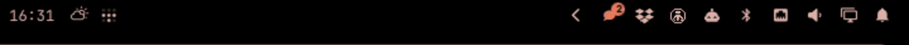
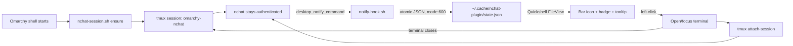

<div align="center">

# Omarchy × nchat

**Keep nchat connected in the background and surface new WhatsApp, Telegram and Signal messages directly in the Omarchy bar.**

[](https://omarchy.org)
[](https://github.com/d99kris/nchat)
[](https://github.com/tmux/tmux)
[](https://quickshell.outfoxxed.me)
[](#install--one-command)
[](LICENSE)

**No notification daemon · No web service · No API token · No polling for messages**



</div>

---

## Quick install

```bash
omarchy plugin add https://github.com/ibrunomendes-coder/omarchy-nchat.git --enable
```

Then click the new chat icon once. The first click backs up and configures nchat, starts its persistent tmux session and opens the attached terminal.

[Installation details and security behavior →](#install--one-command)

## The problem

[nchat](https://github.com/d99kris/nchat) is an excellent terminal client for WhatsApp, Telegram and Signal, but it has two desktop integration problems:

1. its default Linux notification command uses `notify-send`, creating intrusive popups;
2. nchat stops receiving messages as soon as its terminal window closes.

A bar widget alone cannot solve the second problem. The messaging client itself must remain alive somewhere.

## What this plugin does

Omarchy × nchat turns nchat into a small persistent background service without patching nchat or reading its databases:

- installs through Omarchy's native `plugin add <git-url> --enable` flow;
- completes nchat integration on the first explicit icon click, with an atomic config backup;
- starts nchat inside a detached tmux session named `omarchy-nchat`;
- keeps it authenticated when no terminal window is visible;
- replaces `notify-send` with a private local hook;
- displays new-message activity in the Omarchy bar;
- opens or focuses a terminal attached to the running session when clicked;
- leaves nchat running after that terminal closes;
- checks backend health every 30 seconds and recovers a stopped session;
- prevents a managed and a standalone nchat from competing for the same profiles.

> The visible terminal is only a tmux client. The persistent nchat process lives behind it.

## How it works



### Runtime lifecycle

```text
login / shell reload
        │
        ▼
┌─────────────────────────────────────────────┐
│ tmux: omarchy-nchat                         │
│                                             │
│  nchat connected to configured protocols   │
│  ├─ no visible terminal required            │
│  ├─ receives messages                       │
│  └─ calls the notification hook             │
└─────────────────────────────────────────────┘
        ▲                          │
        │ tmux attach              │ new message
        │                          ▼
click bar icon              Omarchy badge lights up
        │
        ▼
terminal opens ── close terminal ──► nchat remains alive
```

## Bar behavior

| State | What you see | Meaning |
|---|---|---|
| Starting | Chat icon in startup state | The managed tmux session is being created |
| Online, quiet | Dim chat icon + status dot | nchat is connected; no new notifications since the last open |
| New activity | Highlighted icon + numeric badge | One or more notification events arrived |
| Offline | Urgent-colored icon/dot | The managed backend is unavailable; click or middle-click to recover |
| External process | Warning tooltip | nchat is already running outside the managed tmux session |

### Mouse actions

| Action | Result |
|---|---|
| **Left click** | Ensure the backend, open/focus the attached terminal, then clear the badge after launch succeeds |
| **Right click** | Clear the badge without opening nchat |
| **Middle click** | Recheck and start the persistent backend |
| **Hover** | Show backend health, event count, last sender and last message |

## What the badge counts

The badge counts **nchat notification events since the last successful open**. It is deliberately not advertised as nchat's canonical unread count.

Its behavior follows your nchat configuration and can exclude:

- muted chats;
- the currently visible chat;
- events received before the managed process started;
- events that nchat itself decides not to notify.

This avoids reading or depending on nchat's private database schema.

## Requirements

| Component | Purpose | Tested version |
|---|---|---|
| Omarchy | Shell, plugin manager and bar host | `4.0.0-1` |
| Quickshell | Reactive widget runtime | `0.3.0` |
| nchat | WhatsApp/Telegram/Signal client | `5.17.26` |
| tmux | Persistent PTY/session backend | `3.7b` |
| jq | Atomic JSON state generation | `1.8+` |
| flock | Concurrent hook/clear locking | util-linux |

nchat must already have at least one account configured. If this is a fresh nchat installation, run `nchat --setup` first.

## Install — one command

```bash
omarchy plugin add https://github.com/ibrunomendes-coder/omarchy-nchat.git --enable
```

Omarchy will:

1. show its standard unsandboxed-plugin security warning;
2. clone the repository into `~/.config/omarchy/plugins/ibrunomendes.nchat`;
3. validate `manifest.json` and every entry point;
4. ask where the widget should live (the default is `right`);
5. enable it in `shell.json`;
6. keep the checkout git-managed for future updates.

### First click completes setup

After installation, the icon appears in a setup-required state. Click it once.

That explicit click authorizes the plugin to:

1. create `~/.config/nchat/ui.conf.omarchy-nchat.bak` once;
2. point `desktop_notify_command` to the hook inside the installed plugin;
3. enable inactive/non-current-chat notifications;
4. disable the inactive terminal bell;
5. start the managed `omarchy-nchat` tmux session;
6. open a terminal attached to it.

The patch is atomic, preserves unrelated nchat settings and never duplicates configuration keys.

Expected health after the first click:

```bash
~/.config/omarchy/plugins/ibrunomendes.nchat/nchat-session.sh status
```

```json
{"online":true,"managed":true,"external":false,"configured":true,"session":"omarchy-nchat"}
```

### Update

Because Omarchy installs the repository as a git checkout:

```bash
omarchy plugin update ibrunomendes.nchat
```

<details>
<summary>Manual installation fallback</summary>

```bash
git clone https://github.com/ibrunomendes-coder/omarchy-nchat.git
cd omarchy-nchat

plugin_dir="$HOME/.config/omarchy/plugins/ibrunomendes.nchat"
install -d -m 700 "$plugin_dir"
install -m 644 manifest.json BarWidget.qml "$plugin_dir/"
install -m 700 nchat-session.sh notify-hook.sh "$plugin_dir/"

omarchy plugin validate "$plugin_dir"
omarchy plugin enable ibrunomendes.nchat
omarchy restart shell
```

Then click the icon once to complete nchat integration.

</details>

## Daily use

You do not need to start nchat manually.

```text
message arrives → badge lights up → click badge → reply → close terminal
                                                        │
                                                        └─ backend stays online
```

### Backend commands

```bash
helper="$HOME/.config/omarchy/plugins/ibrunomendes.nchat/nchat-session.sh"

$helper status   # JSON health status
$helper ensure   # create/recover the managed tmux session
$helper open     # open or focus the attached terminal
$helper clear    # clear notification state
$helper stop     # stop the managed session
```

### Omarchy IPC

```bash
omarchy-shell ibrunomendes.nchat open
omarchy-shell ibrunomendes.nchat clear
omarchy-shell ibrunomendes.nchat ensure
omarchy-shell ibrunomendes.nchat refresh
```

## Privacy and security

- No WhatsApp, Telegram or Signal credentials are handled by this plugin.
- nchat remains the only process connected to the messaging protocols.
- The hook receives only the sender and message text already exposed by nchat's official `desktop_notify_command` placeholders.
- State is local, stored under `${XDG_CACHE_HOME:-~/.cache}/nchat-plugin/`.
- The state directory is mode `700`; state and lock files are mode `600`.
- Writes are atomic and serialized with `flock`.
- The terminal app ID is unique (`org.omarchy.nchat`) to avoid focusing a browser tab whose title happens to contain “nchat”.
- The helper refuses to start a second nchat when a standalone process already exists.

The state file contains the last sender and message so the tooltip can display them. Right-click the icon or run `nchat-session.sh clear` to remove it.

## Tests

```bash
./tests/run
```

The test suite covers:

- Bash and manifest validation;
- concurrent notification writes;
- JSON escaping;
- private file permissions;
- clear-state behavior;
- tmux startup and shutdown;
- idempotent `ensure` calls;
- managed-session health reporting;
- atomic first-click configuration with one-time backup;
- idempotent setup without duplicate keys;
- uninstall restoration that preserves unrelated later changes.

The persistent runtime was additionally validated end-to-end with a real incoming WhatsApp message and a terminal detach test: the same authenticated nchat PID remained alive after the visible terminal closed.

## Troubleshooting

### Icon says setup is required

Click it once. If setup cannot continue, verify that nchat already has an account and `~/.config/nchat/ui.conf` exists. For a fresh installation:

```bash
nchat --setup
```

Then click the widget again.

### Backend says `external: true`

A standalone nchat is already running. Close it, then:

```bash
~/.config/omarchy/plugins/ibrunomendes.nchat/nchat-session.sh ensure
```

### Backend is offline

```bash
helper="$HOME/.config/omarchy/plugins/ibrunomendes.nchat/nchat-session.sh"
$helper status
$helper ensure
```

Middle-clicking the widget performs the same recovery.

### Backend is online but the badge never changes

After receiving a real message while nchat is unfocused, inspect:

```bash
cat ~/.cache/nchat-plugin/state.json | jq
```

If the file does not exist, confirm the absolute `desktop_notify_command` path and restart nchat/the managed session.

### Widget disappears after editing QML

Plugin hot-reload can occasionally drop the bar slot:

```bash
omarchy restart shell
```

### Shell logs

```bash
find /run/user/$(id -u)/quickshell/by-id \
  -name log.log -printf '%T@ %p\n' \
  | sort -rn | head -1
```

## Uninstall

Run cleanup **before** removing the plugin checkout:

```bash
helper="$HOME/.config/omarchy/plugins/ibrunomendes.nchat/nchat-session.sh"
$helper uninstall
omarchy plugin remove ibrunomendes.nchat
omarchy restart shell
```

`uninstall` stops the tmux backend, removes notification state and restores only the five nchat settings owned by the plugin from its backup. Unrelated changes made after installation are preserved.

## Project scope

This project is intentionally small. It does not reimplement a messaging client, read nchat databases or introduce a network daemon. It supplies the missing desktop lifecycle around nchat:

```text
persistent PTY + official notification hook + native Omarchy surface
```

Issues and focused pull requests are welcome on the [public GitHub repository](https://github.com/ibrunomendes-coder/omarchy-nchat).

## License

MIT © Bruno Mendes — see [LICENSE](LICENSE).
