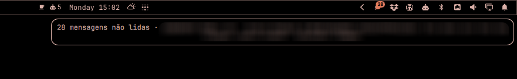

# omarchy-nchat

Unread-message badge for [nchat](https://github.com/d99kris/nchat) (terminal WhatsApp/Telegram/Signal client) on the [Omarchy](https://omarchy.org) shell bar — **without popup notifications stealing your mouse**.

nchat's default desktop notifications use `notify-send`, which spawns popups that constantly pull your cursor/attention away. This plugin replaces them with a silent badge in the status bar:


Hovering shows the count plus the last sender and message:



## How it works

```
nchat ──desktop_notify_command──> notify-hook.sh ──> ~/.cache/nchat-plugin/state.json
                                                              │ (file watch, no polling)
                                              Omarchy bar widget (badge + tooltip)
```

- `notify-hook.sh` is called by nchat on every notification event with the sender (`%1`) and message (`%2`). It maintains a small JSON state file (flock + atomic write via `jq`).
- The bar widget watches that file with Quickshell's `FileView` — no polling — and shows a badge with the unread count.

## Behavior

| Action | Result |
|---|---|
| New message | Badge appears / count increments, silently |
| Left click | Focus the running nchat window, or launch it in a terminal (`omarchy launch or focus tui`), and reset the counter |
| Right click | Reset the counter only |
| Hover | Tooltip: unread count + last sender/message |

IPC (useful for keybindings):

```bash
omarchy-shell ibrunomendes.nchat open    # focus/launch nchat, reset counter
omarchy-shell ibrunomendes.nchat clear   # reset counter only
```

## Requirements

- Omarchy (with the Quickshell-based `omarchy-shell`)
- [nchat](https://github.com/d99kris/nchat)
- `jq`

## Install

**1. Install the plugin:**

```bash
git clone https://github.com/ibrunomendes-coder/omarchy-nchat.git
mkdir -p ~/.config/omarchy/plugins/ibrunomendes.nchat
cp omarchy-nchat/manifest.json omarchy-nchat/BarWidget.qml ~/.config/omarchy/plugins/ibrunomendes.nchat/
```

**2. Install the notification hook:**

```bash
cp omarchy-nchat/notify-hook.sh ~/.config/nchat/
chmod +x ~/.config/nchat/notify-hook.sh
```

**3. Point nchat at the hook** — in `~/.config/nchat/ui.conf`:

```ini
desktop_notify_enabled=1
desktop_notify_command=/home/<you>/.config/nchat/notify-hook.sh '%1' '%2'
desktop_notify_inactive=1
desktop_notify_active_noncurrent=1
```

Use the absolute path (no `~`). To silence the terminal bell as well: `terminal_bell_inactive=0`. If you also want notifications for the currently open chat while the window is focused, set `desktop_notify_active_current=1`. Restart nchat to apply.

**4. Add the widget to your bar** — in `~/.config/omarchy/shell.json`, inside `bar.layout.right` (or any section):

```json
{
  "id": "ibrunomendes.nchat"
}
```

**5. Rescan plugins:**

```bash
omarchy-shell shell rescanPlugins
```

The widget is invisible until the first unread message arrives.

## Uninstall

1. Remove the `{"id": "ibrunomendes.nchat"}` entry from `~/.config/omarchy/shell.json`
2. `rm -rf ~/.config/omarchy/plugins/ibrunomendes.nchat`
3. In `~/.config/nchat/ui.conf`, restore `desktop_notify_command=` (or set `desktop_notify_enabled=0`)

## License

MIT — see [LICENSE](LICENSE).
